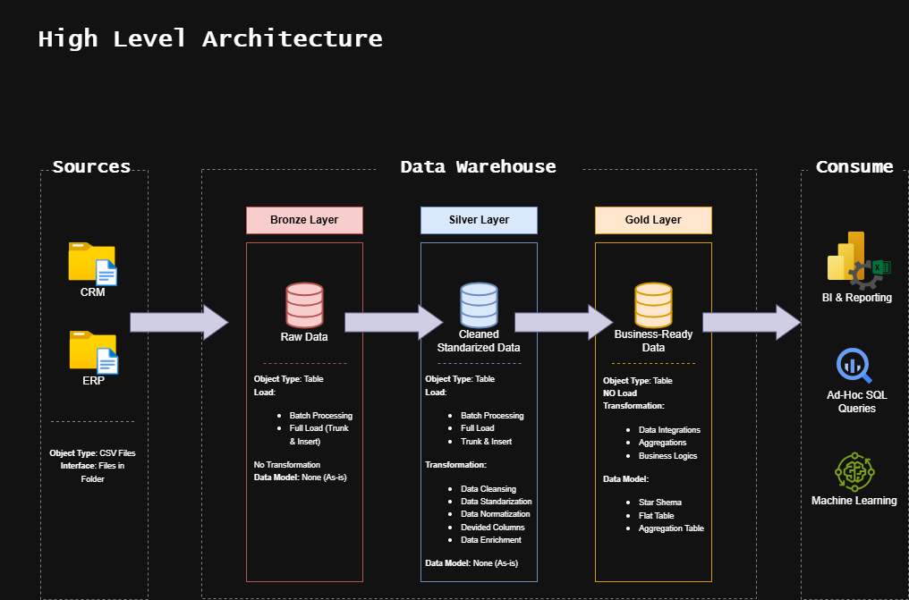

# 📊 SQL Data Warehouse and Analytics Project

Welcome to **Asma's SQL Data Warehouse and Analytics Project**! 🚀  
This project showcases a complete end-to-end data warehousing solution — from ingesting raw data to delivering meaningful analytics using a structured and scalable architecture. This project is built as part of a personal learning journey and portfolio in **data engineering and analytics**.

---

## 🏗️ Data Architecture

This project adopts the **Medallion Architecture** approach using three logical layers: **Bronze**, **Silver**, and **Gold**.



1. **Bronze Layer**: Ingests raw data directly from source CSV files into SQL Server without transformation.
2. **Silver Layer**: Performs data cleaning, standardization, and enrichment for downstream analysis.
3. **Gold Layer**: Contains aggregated and business-ready data modeled using a **star schema** for reporting and dashboards.

---

## 📖 Project Overview

The project includes:

1. **Modern Data Architecture** based on Medallion Layering.
2. **ETL Pipelines** implemented via SQL Server to ingest, clean, and transform data.
3. **Data Modeling** using dimension and fact tables optimized for analytics.
4. **SQL-based Reporting** to generate KPIs and business insights.

🎯 This project is ideal for demonstrating skills in:
- SQL Development
- Data Engineering
- ETL Pipeline Creation
- Data Modeling
- Business Intelligence & Reporting

---

## 🛠️ Tools & Resources Used

All tools used are **open source or free**:

- **[Datasets](datasets/):** Sample CRM and ERP CSV files.
- **[SQL Server Express](https://www.microsoft.com/en-us/sql-server/sql-server-downloads)** – Free SQL Server engine.
- **[SQL Server Management Studio (SSMS)](https://learn.microsoft.com/en-us/sql/ssms/download-sql-server-management-studio-ssms?view=sql-server-ver16)** – GUI for SQL Server development.
- **[DrawIO](https://www.drawio.com/):** For ER diagrams, data flow, and architecture.
- **[GitHub](https://github.com/):** For version control.
- **[Notion Project Board](https://thankful-pangolin-2ca.notion.site/SQL-Data-Warehouse-Project-16ed041640ef80489667cfe2f380b269?pvs=4):** To manage tasks and track project phases.

---

## 🚀 Project Requirements

### Part 1: Data Engineering — Build the Warehouse

#### Objective:
Build a modern data warehouse using SQL Server by integrating data from multiple sources to support analytical decision-making.

#### Key Points:
- **Source Files**: Two datasets (ERP and CRM) in CSV format.
- **ETL Process**: Clean, transform, and integrate data.
- **Star Schema Design**: Create dimension and fact tables to optimize performance.
- **Documentation**: Maintain clear metadata and process documentation.
- **Scope**: Focus on recent data; historization is out of scope.

---

### Part 2: Data Analytics — Business Intelligence

#### Objective:
Generate meaningful insights using SQL queries and structured data models.

#### Key Metrics & Reports:
- **Customer Insights**: Segmentation, location analysis, loyalty trends.
- **Product Performance**: Revenue, returns, category trends.
- **Sales Trends**: Monthly revenue, top regions, time-based growth.

For more info, check: [docs/requirements.md](docs/requirements.md)

---

## 📂 Repository Structure
```
data-warehouse-project/
│
├── datasets/                           # Raw datasets used for the project (ERP and CRM data)
│
├── docs/                               # Project documentation and architecture details
│   ├── etl.drawio                      # Draw.io file shows all different techniquies and methods of ETL
│   ├── data_architecture.drawio        # Draw.io file shows the project's architecture
│   ├── data_catalog.md                 # Catalog of datasets, including field descriptions and metadata
│   ├── data_flow.drawio                # Draw.io file for the data flow diagram
│   ├── data_models.drawio              # Draw.io file for data models (star schema)
│   ├── naming-conventions.md           # Consistent naming guidelines for tables, columns, and files
│
├── scripts/                            # SQL scripts for ETL and transformations
│   ├── bronze/                         # Scripts for extracting and loading raw data
│   ├── silver/                         # Scripts for cleaning and transforming data
│   ├── gold/                           # Scripts for creating analytical models
│
├── tests/                              # Test scripts and quality files
│
├── README.md                           # Project overview and instructions
├── LICENSE                             # License information for the repository
├── .gitignore                          # Files and directories to be ignored by Git
└── requirements.txt                    # Dependencies and requirements for the project
```
---

## 👩‍💻 Author

- **Asma Manai**
- 💼 LinkedIn: https://www.linkedin.com/in/asma-manai/
- 📧 Email: asma.manai@enstab.ucar.tn
